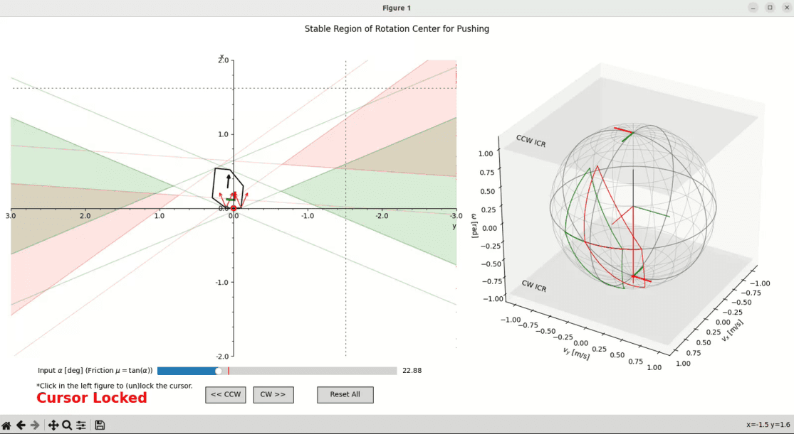
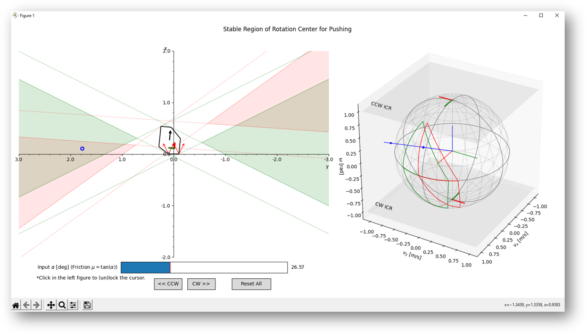

# Rotation Center of Stable Pushing with Line Contact

Interactive visualization of velocity sphere in planar manipulation.
The stable region of instantaneous center of rotation (ICR) drawn in this program is based on the 1996 [PhD thesis](https://www.ri.cmu.edu/publications/nonprehensile-robotic-manipulation-controlability-and-planning/) of [Professor Lynch](https://scholar.google.com/citations?user=yCpbkPAAAAAJ).
Therefore, the stable region calculated in this program tends to be more conservative than the actual stable region.


<!--  -->

Blue cursor means stable ICR, and red cursor means unstable ICR.

## Getting Started

Prepare your virtual environment and install the dependencies.

```sh
python3 -m venv .venv
source .venv/bin/activate
pip3 install -r requirements.txt
```

Execute the script to generate the interactive plot.

```sh
python3 plot.py
```

## Dependancies

- Stable region algorithm (py2, py3)
   - numpy
- Interactive Visualization **(py3 only)**
   - numpy
   - **matplotlib >=3.1, <3.8**
   - **shapely >=1.8, <2.0**

## Reference

- Stable pushing: https://www.cs.cmu.edu/~./mlab/stable/
- Bernheisel, Jay D., and Kevin M. Lynch. "Stable transport of assemblies: Pushing stacked parts." IEEE Transactions on Automation science and Engineering 1.2 (2004): 163-168. ([paper](https://citeseerx.ist.psu.edu/document?repid=rep1&type=pdf&doi=24c0a0372c4c4f40cd506782963f48225ecb19b0))
- Lynch, Kevin Michael. Nonprehensile robotic manipulation: Controllability and planning. Carnegie Mellon University, 1996. ([paper](https://www.ri.cmu.edu/pub_files/pub1/lynch_kevin_1996_1/lynch_kevin_1996_1.pdf))