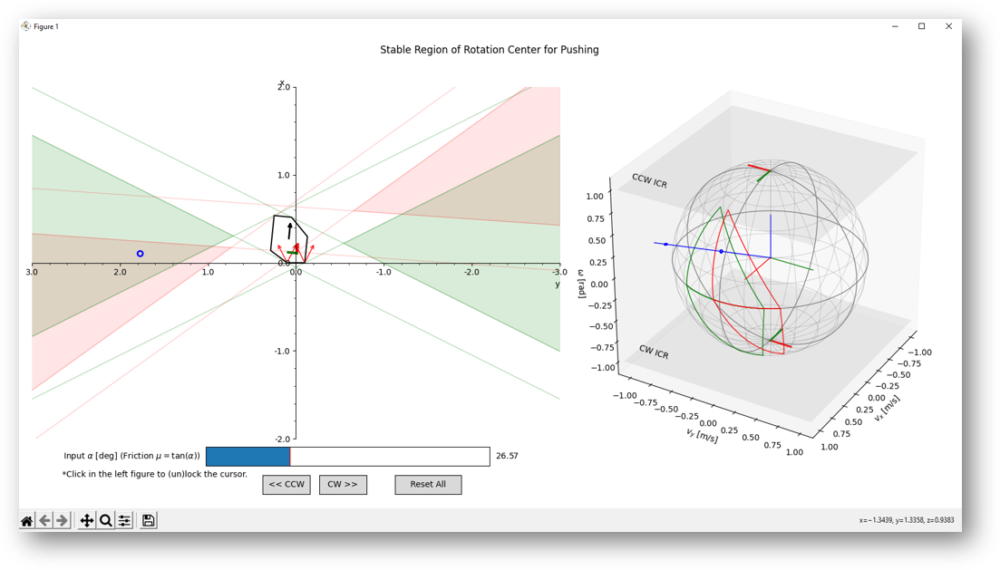

# Rotation Center of Stable Pushing with Line Contact

### Dependancies

- Stable region algorithm (py2, py3)
  - numpy
- Interactive Visualization (py3 only)
  - numpy
  - matplotlib>=3.1.1
  - shapely

### References

- Circular sampling
- Stable pushing: https://www.cs.cmu.edu/~./mlab/stable/
